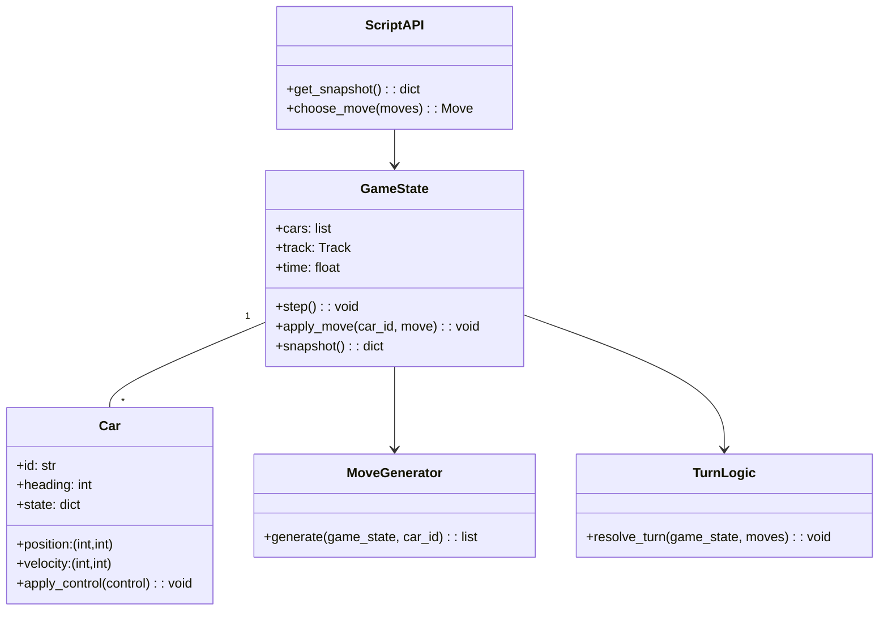

# racecars — Architektura projektu

Tento dokument stručně shrnuje architekturu celého repozitáře a popisuje, jak spolu jednotlivé části komunikují.

## Přehled

Projekt je rozdělen do několika samostatných modulů s čistou odpovědností:
- `racecars/` — hlavní skripty a ukázkové autíčka (scénáře, učitel, svět)
- `simulation/` — herní logika, stav hry, generování tahů a pravidla tahu
- `ui/` — dialogy, ovladače a renderer pro interakci a vizualizaci

Účel rozdělení: udržet simulaci nezávislou na UI a umožnit snadné přidání nových agentů skrze jednoduché API.

## Klíčové objekty a odpovědnosti

- Game / GameState:
  - Umístěn v: [simulation/game_state.py](simulation/game_state.py)
  - Popis: nosný model stavu hry (pozice aut, stav trati, skóre, čas/hybná logika).

- Move generator / pravidla tahu:
  - Umístěno v: [simulation/move_generator.py](simulation/move_generator.py) a [simulation/turn_logic.py](simulation/turn_logic.py)
  - Popis: generuje dostupné tahy pro auto a aplikuje pravidla jednotlivého kola (kolize, rychlostní omezení apod.).

- Agents / auta (manuální a skriptovatelní):
  - Ukázky v: [racecars/Scripts/RandomAuto.py](racecars/Scripts/RandomAuto.py), [racecars/Scripts/Teacher.py](racecars/Scripts/Teacher.py)
  - API pro skripty: [simulation/script_api.py](simulation/script_api.py)
  - Loader skriptů: [simulation/script_loader.py](simulation/script_loader.py)
  - Popis: agenti implementují jednoduché rozhraní (dotaz na dostupné tahy → výběr tahu). Loader zajišťuje bezpečné/izolované zavedení skriptů.

- Track / trať:
  - Generování a reprezentace: [simulation/track_generator.py](simulation/track_generator.py)
  - Popis: vytváří tratě, které zapisuje do `GameState` a které používá simulace při kolizích a kolovém průchodu.

- Parametry a měření výkonu:
  - Parametry hry: [simulation/params.py](simulation/params.py)
  - Výkon/telemetrie: [simulation/performance.py](simulation/performance.py)

- Script / manual helpers:
  - Příklady a utilitky pro tvorbu agentů: [simulation/manual_auto.py](simulation/manual_auto.py)

- Spouštěč / orchestrátor:
  - V `racecars/main.py` je obvyklé místo pro start aplikace: načtení parametrů, inicializaci stavu, zavedení agentů a spuštění smyčky simulace.

- UI a kontrolery:
  - Složka: [ui/](ui)
  - Klíčové soubory: [ui/controller.py](ui/controller.py), [ui/renderer.py](ui/renderer.py), [ui/setup_dialog.py](ui/setup_dialog.py)
  - Popis: UI přijímá stav ze `GameState`, vykresluje ho a posílá uživatelské nebo skriptové vstupy zpět do simulace.

## Data flow (zjednodusene)

1. Aplikace spustí `racecars/main.py` → načte konfiguraci z `simulation/params.py`.
2. `track_generator.py` vytvoří trať a `game_state.py` inicializuje `GameState` s pozicemi aut.
3. `script_loader.py` / UI zaregistrují agenty (soubory v `racecars/Scripts/` nebo runtime skripty).
4. Hlavní smyčka (v main nebo v simulaci): každý tah:
   - Simulace zavolá `move_generator.py` / `turn_logic.py` pro platné tahy.
   - Agent (skript nebo UI) zvolí tah přes `script_api.py` nebo přímo voláním API.
   - `GameState` se aktualizuje, `performance.py` sbírá metriky, renderer vykreslí nový stav.

## Jak přidat nového agenta

1. Vytvoř nový modul v `racecars/Scripts/` implementující jednoduchou funkci, která přijme snapshot `GameState` (nebo API wrapper) a vrátí tah.
2. Upravit/registrovat agenta přes `simulation/script_loader.py` nebo spustit z UI (viz `ui/setup_dialog.py`).
3. Testovat ve smyčce simulace; použít `performance.py` pro měření chování.

## Kde upravovat logiku hry vs. UI

- Hru a pravidla měňte v `simulation/` (safe, jednotné místo pro testování).
- UI měňte v `ui/` — udržujte pouze render/ovládání; neumisťujte do UI herní pravidla.

## Přehled souborů (rychle)

- racecars/main.py — spouštěč a příklady agentů
- racecars/Scripts/* — příkladové agenty a scénáře
- simulation/game_state.py — reprezentace stavu hry
- simulation/move_generator.py — tvorba tahů
- simulation/turn_logic.py — aplikace tahu a řešení kolizí
- simulation/script_api.py — API pro skriptované agenty
- simulation/script_loader.py — pomocník pro načítání agentů
- simulation/track_generator.py — tvorba tratí
- simulation/params.py — konfigurační parametry
- simulation/performance.py — měření a telemetry
- ui/* — dialogy, kontrolery, renderer

## Poznámky pro vývojáře

- Modulární rozložení usnadňuje testování jednotlivých částí (simulace bez UI).
- Při přidávání nových pravidel preferujte úpravy v `turn_logic.py` nebo `move_generator.py`.
- Dokumentaci rozšiřujte přímo u funkcí v modulech a v `specs.md`/`spec_auto.md`.

---

Pokud chceš, mohu doplnit diagram toků nebo návrh tříd/typů pro konkrétní část (např. `GameState`).

## Diagram tříd (Mermaid)

Následující diagram ilustruje hlavní objekty a vztahy mezi nimi.

## Detail `GameState` — návrh

Cíl: reprezentovat kompletní stav simulace tak, aby byla snadno serializovatelná, testovatelná a bezpečná pro snapshoty, které budou předány agentům.

- Atributy:
  - `cars`: seznam (nebo mapování) objektů `Car` s identifikátory.
  - `track`: struktura popisující buňky trati, kontrolní body a limity.
  - `time`: čítač kroků nebo simulovaného času.
  - `history`: volitelné logy posledních N akcí (pro replay/debug).
  - `params`: reference na `simulation/params.py` (konfigurační hodnoty použité při simulaci).

- Metody (veřejné):
  - `snapshot() -> dict` — vrátí lehký, read-only slovník se stavem vhodným pro agenty.
  - `get_car(car_id) -> Car` — vrátí instanci auta (pro interní použití a testy).
  - `apply_move(car_id, move)` — aplikuje vybraný tah na konkrétní auto (neprovádí finální resoluci kolizí).
  - `step()` — spustí kompletní iteraci kola: sesbírá tahy, zavolá `turn_logic.resolve_turn` a aplikuje výsledky.
  - `serialize() -> str` / `to_dict()` — plná serializace pro persistenci nebo síť.

- Interní pomocné metody (neexportovat agentům):
  - `_validate_move(car_id, move)` — kontroluje, že tah je platný vůči aktuálním pravidlům.
  - `_apply_physics(car, delta)` — aktualizuje pozici/rychlost podle jednoduché fyziky.

## Poznámky k implementaci

- `snapshot()` by měl vracet kopii dat (ne referenci) a omezovat množství informací (např. žádné interní logy), aby se zabránilo manipulaci ze strany skriptů.
- `apply_move` a `step` by měly být deterministické — to usnadní testování a porovnávání agentů.
- Při návrhu preferujte jednoduché, explicitní struktury (mapy, seznamy) a jasně pojmenované metody.

---

Dokončeno: do souboru jsem přidal diagram tříd a návrh `GameState`. Chceš, abych vytvořil také samostatný soubor s třídou `GameState` (s kostrou třídy), který by šel ihned použít jako reference pro implementaci?
